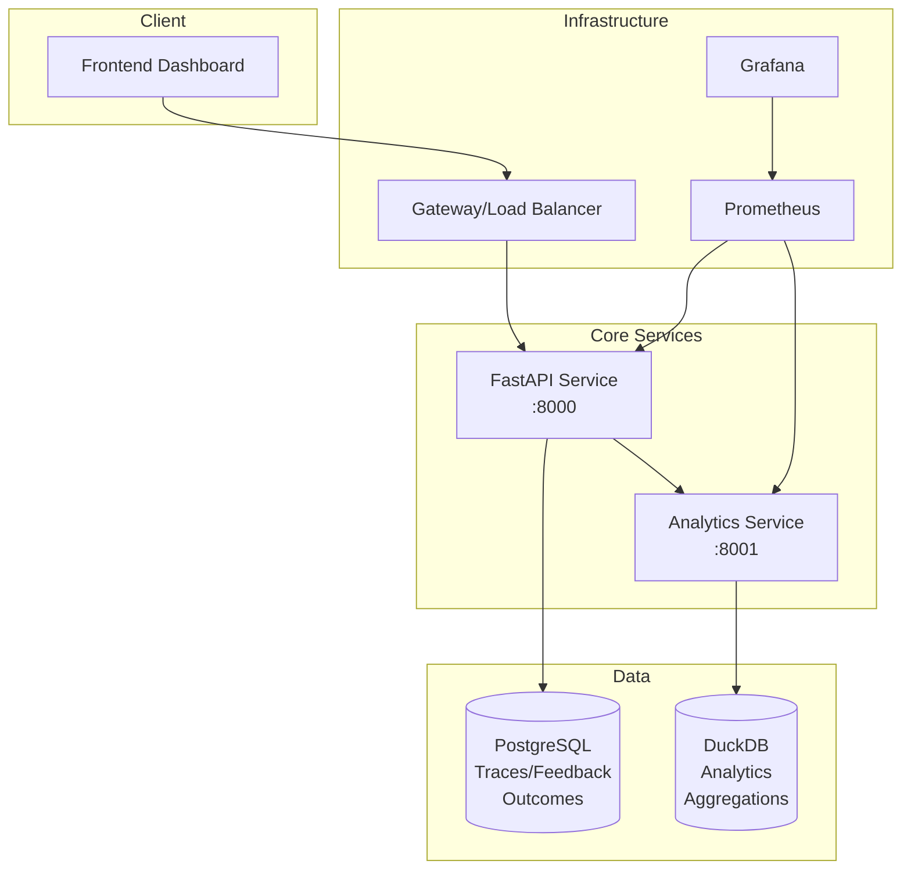
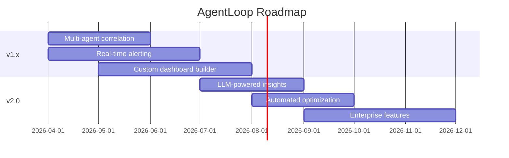

# AgentLoop


**AI Agent Analytics & Insights Platform**

AgentLoop provides comprehensive observability and analytics for AI agent systems. Track workflow execution, understand agent behavior patterns, and derive actionable insights to optimize agent performance.

---

## Architecture



## Quick Start

```bash
# Clone repository
git clone https://github.com/sam1064max/agentloop.git
cd agentloop

# Start all services
docker compose up -d

# Access dashboard
open http://localhost:8080
```

## Feature Matrix

| Feature | Status | Description |
|---------|--------|-------------|
| **Trace Ingestion** | ✅ Stable | Ingest agent execution traces via REST API |
| **Feedback Collection** | ✅ Stable | Collect human/automated feedback on agent outputs |
| **Outcome Tracking** | ✅ Stable | Track final outcomes and success metrics |
| **Workflow Analysis** | ✅ Stable | Analyze workflow paths and execution patterns |
| **Agent Version Comparison** | ✅ Stable | Compare performance across agent versions |
| **Root Cause Insights** | ✅ Stable | ML-powered root cause analysis |
| **Executive Dashboard** | ✅ Stable | KPI overview and executive reporting |
| **Custom Dashboards** | 🏗 WIP | Grafana dashboard builder |
| **Alerting** | 🏗 WIP | Anomaly detection and alerting |
| **Multi-Agent Support** | 🔮 Planned | Cross-agent correlation and analysis |

## Use Cases

### For AI Engineering Teams
- **Debug agent failures**: Trace execution paths reveal where and why agents fail
- **Optimize token usage**: Identify redundant calls and optimize prompts
- **A/B test agent versions**: Compare success rates across versions

### For Product Managers
- **Understand user journeys**: See how users interact with AI features
- **Track KPIs**: Monitor completion rates, satisfaction scores
- **Inform roadmap**: Data-driven decisions on agent improvements

### For Data Scientists
- **Feature engineering**: Use trace data for model improvement
- **Anomaly detection**: Identify unusual patterns in agent behavior
- **Attribution modeling**: Understand what drives positive outcomes

## Competitive Positioning

| Capability | AgentLoop | DataDog | Honeycomb | Custom |
|------------|-----------|---------|-----------|--------|
| Agent-specific metrics | ✅ | ❌ | ❌ | ❌ |
| Workflow path analysis | ✅ | ❌ | ❌ | ❌ |
| Agent version comparison | ✅ | ❌ | ❌ | ❌ |
| Root cause insights | ✅ | ❌ | 🟡 | ❌ |
| Outcome attribution | ✅ | ❌ | ❌ | ❌ |
| Fast setup (< 1 hour) | ✅ | ❌ | ❌ | ❌ |
| Open source | ✅ | ❌ | ❌ | N/A |

## Roadmap



## Screenshots

| Dashboard | Workflow Analysis |
|-----------|-------------------|
|  |  |

---

## License

MIT License - see [LICENSE](LICENSE) for details.