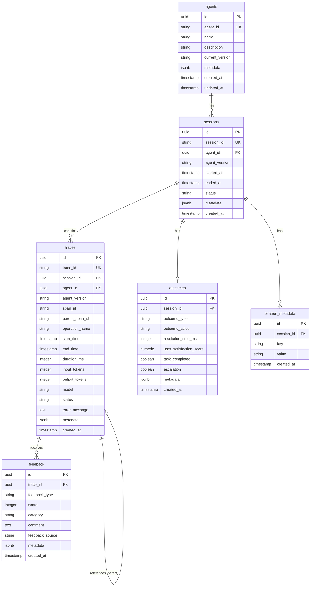

# AgentLoop Data Model

## Overview

AgentLoop uses two database systems:
- **PostgreSQL**: Primary store for operational data (traces, feedback, outcomes)
- **DuckDB**: Analytics-optimized store for aggregations and analysis

## PostgreSQL Schema

### Entity Relationship Diagram



## Table Definitions

### agents

Stores agent metadata.

| Column | Type | Constraints | Description |
|--------|------|-------------|-------------|
| id | UUID | PK | Internal ID |
| agent_id | VARCHAR(255) | UNIQUE, NOT NULL | External agent identifier |
| name | VARCHAR(255) | NOT NULL | Human-readable name |
| description | TEXT | | Agent description |
| current_version | VARCHAR(50) | | Current deployed version |
| metadata | JSONB | | Additional agent configuration |
| created_at | TIMESTAMP | DEFAULT NOW() | Creation timestamp |
| updated_at | TIMESTAMP | DEFAULT NOW() | Last update timestamp |

### sessions

Tracks conversation/interaction sessions.

| Column | Type | Constraints | Description |
|--------|------|-------------|-------------|
| id | UUID | PK | Internal ID |
| session_id | VARCHAR(255) | UNIQUE, NOT NULL | External session identifier |
| agent_id | UUID | FK → agents | Associated agent |
| agent_version | VARCHAR(50) | | Agent version for this session |
| started_at | TIMESTAMP | NOT NULL | Session start time |
| ended_at | TIMESTAMP | | Session end time |
| status | VARCHAR(50) | | active, completed, failed, timeout |
| metadata | JSONB | | Session context data |
| created_at | TIMESTAMP | DEFAULT NOW() | Record creation time |

### traces

Records individual operation executions within sessions.

| Column | Type | Constraints | Description |
|--------|------|-------------|-------------|
| id | UUID | PK | Internal ID |
| trace_id | VARCHAR(255) | UNIQUE, NOT NULL | External trace identifier |
| session_id | UUID | FK → sessions, NOT NULL | Parent session |
| agent_id | UUID | FK → agents | Agent that generated trace |
| agent_version | VARCHAR(50) | | Agent version |
| span_id | VARCHAR(255) | NOT NULL | Span identifier within trace |
| parent_span_id | VARCHAR(255) | | Parent span for hierarchy |
| operation_name | VARCHAR(255) | NOT NULL | Operation/type being traced |
| start_time | TIMESTAMP | NOT NULL | Operation start |
| end_time | TIMESTAMP | NOT NULL | Operation end |
| duration_ms | INTEGER | | Duration in milliseconds |
| input_tokens | INTEGER | | LLM input tokens consumed |
| output_tokens | INTEGER | | LLM output tokens produced |
| model | VARCHAR(100) | | LLM model used (if applicable) |
| status | VARCHAR(50) | NOT NULL | success, error, timeout |
| error_message | TEXT | | Error details if failed |
| metadata | JSONB | | Operation-specific data |
| created_at | TIMESTAMP | DEFAULT NOW() | Record creation time |

**Indexes:**
- `idx_traces_session_id` ON (session_id)
- `idx_traces_agent_id` ON (agent_id)
- `idx_traces_operation_name` ON (operation_name)
- `idx_traces_start_time` ON (start_time)
- `idx_traces_status` ON (status)

### feedback

Stores feedback on traced operations.

| Column | Type | Constraints | Description |
|--------|------|-------------|-------------|
| id | UUID | PK | Internal ID |
| trace_id | UUID | FK → traces, NOT NULL | Associated trace |
| feedback_type | VARCHAR(100) | NOT NULL | human_rating, automated, implicit |
| score | INTEGER | | Numeric score (typically 1-5) |
| category | VARCHAR(100) | | accuracy, helpfulness, speed, safety |
| comment | TEXT | | Free-form feedback |
| feedback_source | VARCHAR(100) | | human_evaluator, automated_system, user |
| metadata | JSONB | | Additional feedback context |
| created_at | TIMESTAMP | DEFAULT NOW() | Feedback submission time |

**Indexes:**
- `idx_feedback_trace_id` ON (trace_id)
- `idx_feedback_category` ON (category)

### outcomes

Records final session outcomes.

| Column | Type | Constraints | Description |
|--------|------|-------------|-------------|
| id | UUID | PK | Internal ID |
| session_id | UUID | FK → sessions, UNIQUE | Associated session |
| outcome_type | VARCHAR(100) | NOT NULL | resolution, abandonment, escalation |
| outcome_value | VARCHAR(100) | NOT NULL | success, failure, partial |
| resolution_time_ms | INTEGER | | Time to resolution |
| user_satisfaction_score | DECIMAL(3,2) | | Post-interaction satisfaction |
| task_completed | BOOLEAN | | Whether task was completed |
| escalation | BOOLEAN | | Whether human escalation occurred |
| metadata | JSONB | | Outcome-specific data |
| created_at | TIMESTAMP | DEFAULT NOW() | Record creation time |

### session_metadata

Key-value metadata for sessions.

| Column | Type | Constraints | Description |
|--------|------|-------------|-------------|
| id | UUID | PK | Internal ID |
| session_id | UUID | FK → sessions | Associated session |
| key | VARCHAR(255) | NOT NULL | Metadata key |
| value | TEXT | | Metadata value |
| created_at | TIMESTAMP | DEFAULT NOW() | Creation time |

**Indexes:**
- `idx_session_metadata_session_id` ON (session_id)
- `idx_session_metadata_key` ON (key)

---

## DuckDB Schema

### Analytics Tables

DuckDB contains denormalized, analytics-optimized tables populated via ETL from PostgreSQL.

### analytics_sessions

Session-level aggregations for fast dashboard queries.

| Column | Type | Description |
|--------|------|-------------|
| session_id | VARCHAR | External session ID |
| agent_id | VARCHAR | Agent identifier |
| agent_version | VARCHAR | Agent version |
| started_at | TIMESTAMP | Session start |
| ended_at | TIMESTAMP | Session end |
| duration_ms | BIGINT | Total session duration |
| trace_count | INTEGER | Number of traces |
| error_count | INTEGER | Number of failed traces |
| total_input_tokens | BIGINT | Total input tokens |
| total_output_tokens | BIGINT | Total output tokens |
| outcome_type | VARCHAR | Outcome category |
| outcome_value | VARCHAR | Outcome value |
| task_completed | BOOLEAN | Task completion flag |
| user_satisfaction | DECIMAL | Satisfaction score |
| avg_feedback_score | DECIMAL | Average feedback score |

### workflow_paths

Aggregated workflow path analysis.

| Column | Type | Description |
|--------|------|-------------|
| agent_id | VARCHAR | Agent identifier |
| agent_version | VARCHAR | Agent version |
| workflow_name | VARCHAR | Name of workflow pattern |
| path_sequence | VARCHAR | Ordered list of operations |
| execution_count | BIGINT | Times this path executed |
| success_count | BIGINT | Successful executions |
| success_rate | DECIMAL | Success percentage |
| avg_duration_ms | BIGINT | Average path duration |
| avg_feedback_score | DECIMAL | Average feedback |

### agent_metrics

Agent performance metrics by version and time period.

| Column | Type | Description |
|--------|------|-------------|
| agent_id | VARCHAR | Agent identifier |
| agent_version | VARCHAR | Agent version |
| period_start | DATE | Period start |
| period_end | DATE | Period end |
| total_traces | BIGINT | Total traces |
| success_count | BIGINT | Successful traces |
| error_count | BIGINT | Failed traces |
| success_rate | DECIMAL | Success percentage |
| avg_duration_ms | DECIMAL | Average duration |
| p50_duration_ms | DECIMAL | 50th percentile duration |
| p95_duration_ms | DECIMAL | 95th percentile duration |
| p99_duration_ms | DECIMAL | 99th percentile duration |
| avg_input_tokens | DECIMAL | Average input tokens |
| avg_output_tokens | DECIMAL | Average output tokens |
| avg_feedback_score | DECIMAL | Average feedback |

### insights

Generated insights and recommendations.

| Column | Type | Description |
|--------|------|-------------|
| insight_id | VARCHAR | Unique insight ID |
| agent_id | VARCHAR | Affected agent |
| metric | VARCHAR | Target metric |
| severity | VARCHAR | high, medium, low |
| description | VARCHAR | Insight description |
| root_cause | VARCHAR | Identified root cause |
| recommendation | VARCHAR | Suggested action |
| affected_count | BIGINT | Number of affected items |
| estimated_impact | VARCHAR | Expected improvement |
| created_at | TIMESTAMP | Insight generation time |
| resolved_at | TIMESTAMP | When insight was addressed |

---

## ETL Process

### PostgreSQL → DuckDB Sync

```
┌─────────────┐     ETL Job      ┌─────────────┐
│ PostgreSQL  │ ──────────────▶  │   DuckDB    │
│  (Source)   │  (hourly sync)   │  (Target)   │
└─────────────┘                  └─────────────┘
```

### Sync Schedule
- Full sync: Daily at 02:00 UTC
- Incremental sync: Every hour
- Real-time metrics: Via API aggregation

### Data Retention
| Store | Hot | Warm | Cold | Archive |
|-------|-----|------|------|---------|
| PostgreSQL | 90 days | - | 1 year | 7 years |
| DuckDB | 1 year | - | - | 3 years |